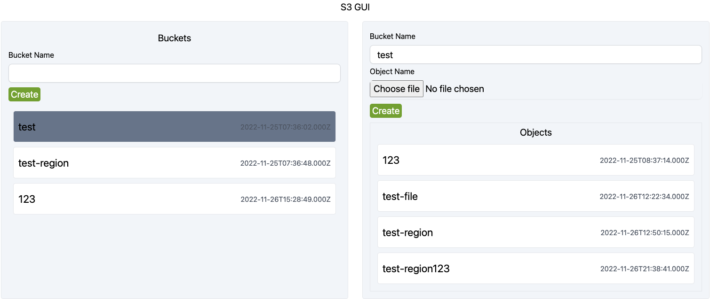

# Local Dashboard S3
Local dashboard S3 is a web-based tool for S3.



## Usage
#### Docker
```bash
docker pull abrahamlawson/local-dashboard-s3
```
**docker-compose** example: [link](./example/docker-compose.yml)


## Tech Stack
- BE: ExpressJS
- FE: ReactJS
- Monorepo (NPM workspace)

**Different ports used by the services the project spins up**
- 3000 - Web
- 3001 - Server/Api

## Source tree 🌲
```
.
├── Dockerfile
├── Readme.md
├── app <-- web
│   ├── README.md
│   ├── package.json
│   ├── public
│   ├── src
│   ├── tailwind.config.js
│   └── tsconfig.json
├── assets
│   └── home.png
├── docker-compose.yml
├── example
│   └── docker-compose.yml
├── package-lock.json
├── package.json
├── server <- server/api
│   ├── dist
│   ├── nodemon.json
│   ├── package.json
│   ├── src
│   └── tsconfig.json
├── shared
│   ├── constant
│   ├── dist
│   ├── index.ts
│   ├── interface
│   ├── package.json
│   └── tsconfig.json
├── todo.md
└── tsconfig.json
```

## API documentation
https://documenter.getpostman.com/view/16258208/2s8YswQXCC